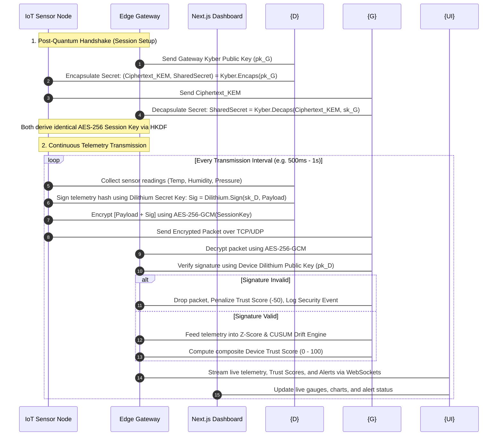

# PQC-Resilient IoT Gateway with Real-Time Drift Detection
> **Final Year Computer Science & Engineering Major Project Blueprint**

---

## 1. Project Overview & Executive Summary

The **Post-Quantum Cryptography (PQC) Resilient IoT Gateway** is an edge-security platform designed to protect connected IoT ecosystems from both **future quantum computing threats** and **real-time sensor tampering/behavioral drift**.

Traditional IoT infrastructures rely on classical asymmetric algorithms like **RSA** and **ECC (Elliptic Curve Cryptography)**. With the emergence of quantum computing and Shor’s algorithm, these classical cryptosystems are rendered obsolete. Furthermore, adversaries are actively executing **"Harvest Now, Decrypt Later" (HNDL)** attacks—intercepting and storing encrypted IoT telemetry today to decrypt once cryptographically relevant quantum computers (CRQCs) become available.

This project delivers a **unified dual-layer security architecture**:
1. **Cryptographic Security Layer:** Implements NIST-standardized Post-Quantum Cryptography (**ML-KEM / CRYSTALS-Kyber** for quantum-safe key exchange and **ML-DSA / CRYSTALS-Dilithium** for digital signatures) paired with authenticated symmetric encryption (**AES-256-GCM**).
2. **Behavioral Trust & Drift Layer:** A real-time statistical stream processing engine (**Rolling Z-Score + CUSUM**) that evaluates sensor telemetry in the clear, calculating continuous **Device Trust Scores (0–100)** to detect physical tampering, sensor degradation, and stealthy spoofing.
3. **Observability & Analytics Layer:** A high-performance **Next.js Real-Time Dashboard** connected via WebSockets that visualizes device telemetry, trust metrics, cryptographic verification statuses, and instant security alerts.

---

## 2. Problem Statement & Motivation

```
                       ┌─────────────────────────────────────────────────────────┐
                       │               THE DUAL THREAT TO IOT                    │
                       └────────────────────────────┬────────────────────────────┘
                                                    │
                   ┌────────────────────────────────┴────────────────────────────────┐
                   ▼                                                                 ▼
      [ Cryptographic Threat ]                                          [ Behavioral / Physical Threat ]
  • RSA / ECC vulnerable to Shor's Algorithm                        • Compromised sensors sending spoofed data
  • Harvest Now, Decrypt Later (HNDL) attacks                       • Subtle sensor drift (temperature/pressure)
  • Quantum adversaries break long-term secrets                     • No behavioral trust validation in gateways
```

### Why Existing Solutions Fall Short:
* **Siloed Research:** Existing studies evaluate PQC benchmarks in isolation or study anomaly detection separately; none unite them into a deployable, production-ready edge gateway.
* **Lack of Real-Time Validation:** Standard encryption secures the transit pipe, but if a sensor itself is compromised or malfunctioning at the hardware level, the gateway blindly trusts corrupt encrypted data.

---

## 3. System Architecture & Tier Breakdown

The system adopts a **Three-Tier Architecture**:

```
 ┌─────────────────────────────────┐
 │       1. IoT Device Layer       │
 │   • Sensor Telemetry Generator  │
 │   • Dilithium Digital Signer    │
 │   • Kyber KEM + AES Encryptor   │
 └────────────────┬────────────────┘
                  │
                  │  [ TCP / UDP Sockets ]
                  │  (PQC Encrypted + Signed Packets)
                  ▼
 ┌─────────────────────────────────┐
 │      2. Edge Gateway Layer      │
 │   • Socket Listener / Router    │
 │   • Dilithium Signature Verify  │
 │   • Kyber Decapsulation + AES   │
 │   • Z-Score & CUSUM Drift Engine│
 │   • Trust Score Assignment      │
 │   • WebSocket Broadcast Engine  │
 └────────────────┬────────────────┘
                  │
                  │  [ Real-Time WebSockets ]
                  ▼
 ┌─────────────────────────────────┐
 │  3. Monitoring Dashboard Layer  │
 │   • Next.js / Tailwind UI       │
 │   • Trust Score Gauges (0-100)  │
 │   • Live Telemetry Stream Charts│
 │   • Anomaly & Quarantine Logs   │
 └─────────────────────────────────┘
```

---

## 4. End-to-End Data Flow & Handshake Protocol



---

## 5. Technology Stack Breakdown

| Layer | Component | Technology / Library | Role & Justification |
| :--- | :--- | :--- | :--- |
| **PQC Cryptography** | Key Encapsulation (KEM) | **ML-KEM (CRYSTALS-Kyber-768)** via `liboqs` | NIST standard for quantum-safe key exchange; provides Level 3 security with fast encapsulation. |
| | Digital Signatures | **ML-DSA (CRYSTALS-Dilithium-3)** via `liboqs` | NIST standard for post-quantum authentication & non-repudiation. |
| | Symmetric Encryption | **AES-256-GCM** (OpenSSL / `cryptography`) | Authenticated symmetric encryption for high-throughput packet data. |
| **Edge Gateway** | Core Server Engine | **Python 3.11 / C++17** | Handles multi-threaded socket communication, cryptographic operations, and real-time data ingestion. |
| | Real-time Streaming | **WebSockets (`websockets` / `Socket.IO`)** | Low-latency bi-directional streaming of processed telemetry to frontend. |
| **Drift & Analytics** | Statistical Drift Engine | **NumPy, SciPy** | Real-time Z-score, rolling average, and Cumulative Sum (CUSUM) calculations. |
| | Trust Scoring Engine | **Custom Algorithm** | Mathematical scoring engine outputting normalized 0–100 device health/trust metrics. |
| **Frontend & UI** | Dashboard Framework | **Next.js 14 / React 18** | Modern, responsive web frontend with server-side rendering and client streaming. |
| | Styling & Components | **Tailwind CSS + Shadcn UI + Lucide** | High-aesthetic dark-mode UI with cards, gauges, and tables. |
| | Real-Time Charting | **Recharts / Chart.js** | Multi-channel streaming line charts for sensor data and trust scores. |
| **Simulation / Node**| Sensor Fleet Simulator | **Python (AsyncIO / Multiprocessing)** | Simulates 50+ concurrent IoT nodes with configurable sensor profiles and attack injectors. |
| | *(Optional)* Hardware Node | **ESP32 / Raspberry Pi + DHT22/BMP280** | Demonstrates real physical sensor hardware integrated into the PQC gateway. |

---

## 6. Mathematical Drift Detection & Trust Scoring Formulation

### 1. Rolling Window Z-Score (Sudden Anomaly Detection)
Given a sliding window of historical readings $W = \{x_1, x_2, \dots, x_N\}$ for a sensor channel:
$$\mu = \frac{1}{N}\sum_{i=1}^{N} x_i, \quad \sigma = \sqrt{\frac{1}{N}\sum_{i=1}^{N}(x_i - \mu)^2}$$
For an incoming reading $x_t$:
$$Z_t = \frac{|x_t - \mu|}{\sigma}$$
* **Normal Behavior:** $Z_t < 2.5$
* **Warning:** $2.5 \le Z_t < 3.5$
* **Critical Anomaly:** $Z_t \ge 3.5$

### 2. Cumulative Sum - CUSUM (Stealthy / Gradual Drift Detection)
Detects subtle, gradual shifts in the process mean that single-point Z-scores miss:
$$S_t^+ = \max(0, S_{t-1}^+ + (x_t - \mu - k))$$
$$S_t^- = \max(0, S_{t-1}^- - (x_t - \mu + k))$$
where $k = \frac{\delta}{2} \cdot \sigma$ is the slack parameter, and an alarm is raised when $\max(S_t^+, S_t^-) > h \cdot \sigma$ ($h$ is the decision threshold).

### 3. Dynamic Trust Score Assignment
The composite Device Trust Score $T_t \in [0, 100]$ at time $t$ is computed as:
$$T_t = T_{t-1} \cdot \lambda - \Delta_{\text{sig}} - \Delta_{\text{Z-score}} - \Delta_{\text{CUSUM}} + R_{\text{recovery}}$$
* $\lambda$: Memory decay factor ($0.95 \le \lambda \le 0.99$)
* $\Delta_{\text{sig}}$: Signature verification penalty (instant drop to $0$ if forged)
* $\Delta_{\text{Z-score}}, \Delta_{\text{CUSUM}}$: Penalties proportional to anomaly magnitude
* $R_{\text{recovery}}$: Gradual trust restoration reward for continuous valid transmissions

```
 Trust Score Ranges:
  ├── [80 - 100]  : Trusted (Green)   --> Full throughput, normal logging
  ├── [50 - 79]   : Degraded (Yellow) --> Warning alert, higher logging frequency
  └── [00 - 49]   : Untrusted (Red)   --> Quarantine, drop session key, alarm
```

---

## 7. Hardware vs. Simulation Setup Guide

### Mode A: 100% Pure Software Simulation (Standard & Recommended)
* **Hardware Needed:** A standard laptop/PC (Windows with WSL2, Linux, or macOS).
* **Execution:**
  * One terminal runs `gateway_server.py` (or C++ gateway binary).
  * Second terminal runs `sensor_simulator.py` (spawns 20–50 concurrent virtual nodes).
  * Third terminal runs `npm run dev` for the Next.js Dashboard (`http://localhost:3000`).
* **Interactive Attack Injection:** A built-in CLI command allows the presenter to inject:
  1. *Gradual Drift Attack* (`inject_drift --device 14 --rate 0.2`)
  2. *Sudden Spike Attack* (`inject_spike --device 3 --val 150.0`)
  3. *Signature Forgery / MITM Attack* (`tamper_packet --device 7`)
  4. *Replay Attack* (`replay_packet --device 2`)

### Mode B: Hybrid Physical Hardware Setup (Optional Bonus Demonstration)
* **Hardware Needed:** 
  * 1 × Raspberry Pi 4 / 5 (or 1 × ESP32 Microcontroller ~₹450).
  * 1 × DHT11 / DHT22 (Temperature & Humidity Sensor) or BMP280.
* **Execution:**
  * The physical microcontroller collects real ambient data, signs packets, and transmits via Wi-Fi to the Gateway laptop.
  * The remaining 49 virtual sensors run concurrently in software.
  * You can physically apply heat (e.g., blow warm air on the DHT22) to show immediate real-world drift detection on the dashboard.

---

## 8. Step-by-Step Implementation Roadmap

```
Phase 1: Environment & Cryptographic Primitives (Weeks 1-2)
  ├── Install liboqs, liboqs-python, OpenSSL 3.x
  ├── Implement Kyber-768 Key Encapsulation & Shared Secret derivation
  └── Implement Dilithium-3 Key Generation, Signing, and Verification tests

Phase 2: IoT Telemetry Simulator & Socket Networking (Weeks 3-4)
  ├── Build multi-sensor telemetry packet generator (JSON/Binary serialization)
  ├── Implement TCP/UDP socket transmission with AES-256-GCM encryption
  └── Add attack injection switches (Spike, Drift, Signature Tamper)

Phase 3: Edge Gateway & Behavioral Analytics Engine (Weeks 5-6)
  ├── Build multi-threaded socket listener on Edge Gateway
  ├── Integrate liboqs decryption and signature verification pipeline
  ├── Implement Rolling Z-Score and CUSUM drift detection module
  └── Build Dynamic Trust Scoring Engine with quarantine logic

Phase 4: Real-Time Dashboard & Observability (Weeks 7-8)
  ├── Set up Next.js 14 project with TailwindCSS and Lucide icons
  ├── Establish WebSocket bridge between Gateway and Next.js frontend
  ├── Build Device Fleet Overview, Real-Time Charting, and Trust Score Gauges
  └── Build Security Incident Log & Quarantine Action Center

Phase 5: Benchmarking, Validation & Documentation (Weeks 9-10)
  ├── Benchmark PQC (Kyber/Dilithium) vs Classical (RSA-2048/ECC-P256)
  │     ├── Key Generation Time (ms)
  │     ├── Encapsulation / Signing Time (ms)
  │     ├── Ciphertext / Signature Size (bytes)
  │     └── Memory / CPU Overhead on Edge
  ├── Validate scalability under 50+ concurrent simulated devices (<100ms latency)
  └── Finalize Project Report, IEEE Conference Paper draft, and Viva Slides
```

---

## 9. Classical vs. Post-Quantum Benchmarking Target

During the final year project defense, having concrete empirical benchmark data guarantees high evaluation scores:

| Cryptographic Scheme | Primitive Type | Security Level | Key / Signature Size | Execution Latency | Quantum Resilient? |
| :--- | :--- | :--- | :--- | :--- | :---: |
| **RSA-2048** | Classical Asymmetric | ~112-bit Classical | ~256 bytes | Slow Keygen (~15ms) | ❌ Broken by Shor |
| **ECDSA (P-256)** | Classical Asymmetric | 128-bit Classical | ~64 bytes | Fast (~1.2ms) | ❌ Broken by Shor |
| **ML-KEM (Kyber-768)** | Lattice-based PQC (KEM) | NIST Level 3 (~192-bit Quantum) | 1,088 bytes Ciphertext | Ultra-fast (~0.08ms) | ✅ Quantum-Safe |
| **ML-DSA (Dilithium-3)**| Lattice-based PQC (Signature) | NIST Level 3 (~192-bit Quantum) | 3,293 bytes Signature | Fast (~0.35ms) | ✅ Quantum-Safe |

---

## 10. Expected Viva Questions & Defense Answers

1. **Q: Why combine Post-Quantum Cryptography with Drift Detection? Isn't encryption enough?**
   * *Answer:* Encryption only guarantees **transit security** (that the packet was not intercepted or altered on the wire). It does not guarantee that the sensor itself hasn't been physically compromised, degraded, or fed false physical inputs. The drift detection engine provides a second layer of **behavioral trust validation** in the clear.

2. **Q: How does Kyber (ML-KEM) differ from traditional Diffie-Hellman?**
   * *Answer:* Diffie-Hellman relies on the hardness of the Discrete Logarithm problem, easily solvable by Shor's algorithm on a quantum computer. Kyber is a Key Encapsulation Mechanism (KEM) based on the hardness of the **Module Learning With Errors (M-LWE)** problem over polynomial lattices, for which no known quantum or classical polynomial-time algorithm exists.

3. **Q: Why use CUSUM in addition to standard Z-scores?**
   * *Answer:* Z-score only detects immediate, large spikes. A stealthy attacker can inject microscopic offsets (e.g., +0.05°C per minute) that stay below a $3\sigma$ threshold. CUSUM integrates these deviations cumulatively over time, detecting gradual drift that would otherwise bypass threshold alarms.

4. **Q: How will the system scale to 50+ or 100+ devices?**
   * *Answer:* The edge gateway uses non-blocking asynchronous socket I/O (or thread pooling), keeping active cryptographic sessions in an in-memory state table. AES-256-GCM operates with hardware acceleration (AES-NI), ensuring per-packet processing times remain under 5 milliseconds.
